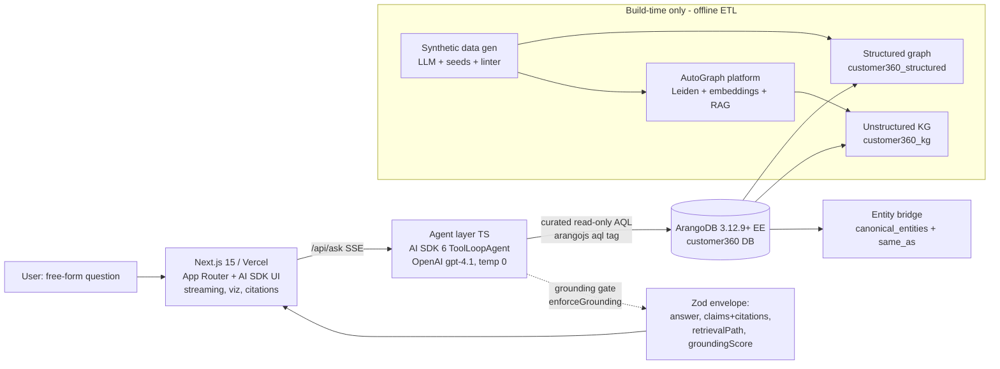
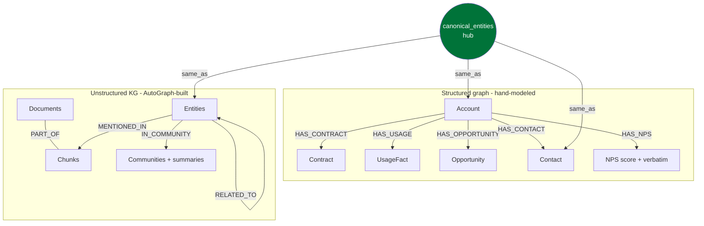
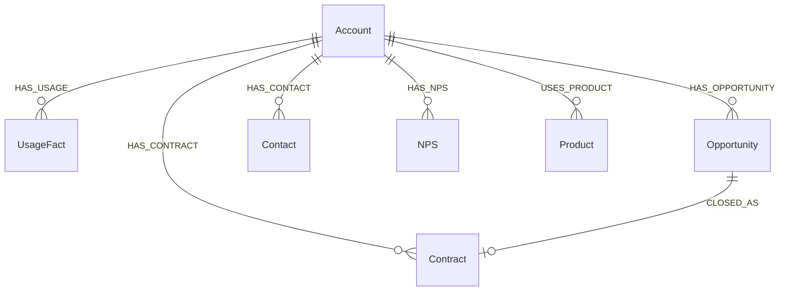
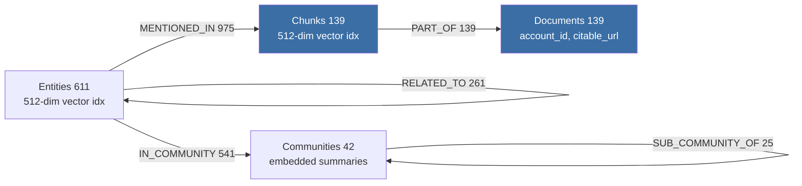
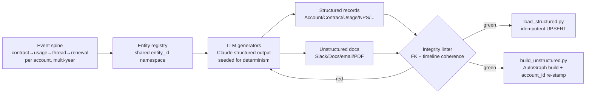
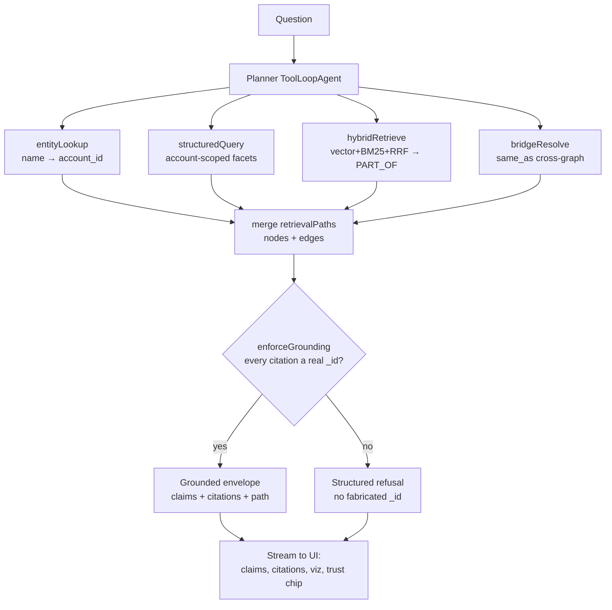
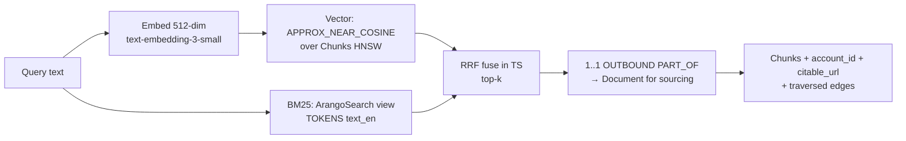
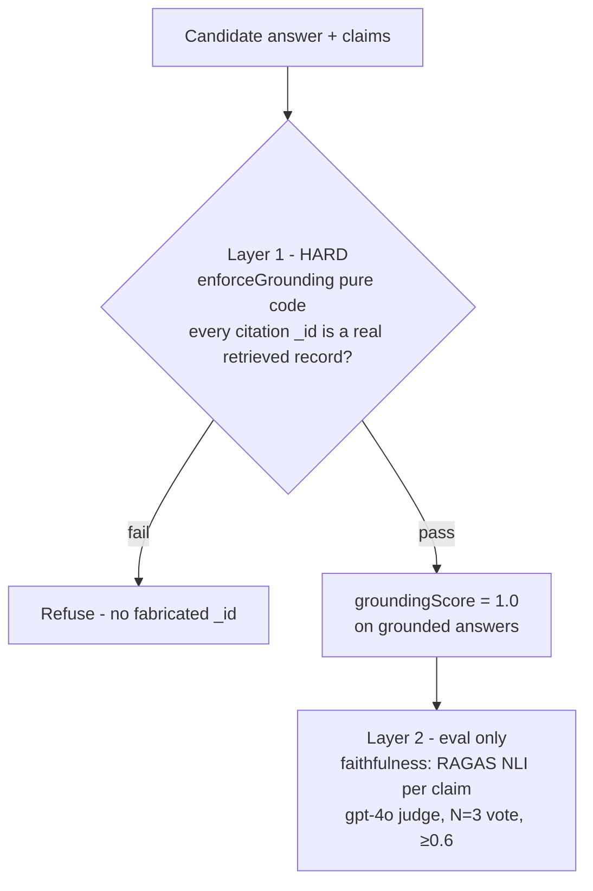

# Customer 360 (Graph-Based Demo) — Project Summary
### Internal Review Deck · NOT customer-facing · 2026-06-25

> **How to use this file:** Each `## Slide N` is one PowerPoint slide. Diagrams are provided as
> **Mermaid** code blocks — paste into <https://mermaid.live> and export PNG, or render with Marp/
> pandoc. Where a diagram is best captured from the running app, a **📸 SCREENSHOT** callout says
> exactly what to grab (consolidated list on the last slide). Speaker-note bullets are written for an
> internal technical audience (AE + SE leadership), so they state honest current limitations, not
> just the pitch.

---

## Slide 1 — What this is

**Customer 360, graph-based** — a custom agent takes a free-form natural-language question, queries
**two ArangoDB graphs** (a structured graph from Salesforce/Snowflake/DocuSign-style sources and an
unstructured GraphRAG knowledge graph from Slack/Docs/email/PDF), reasons across both, and returns
an answer where **every fact is traceable** to the record, graph, and traversal it came from.

- **Strategic purpose:** a *sales demo* to make **ArangoDB the platform** legible to a Zscaler buyer
  — not a product, not (yet) a POC. The agent is the vehicle; ArangoDB is the product.
- **Core value:** a question only answerable by *joining* the two graphs returns a **correct,
  fully-sourced** answer. Grounding + traceability are the whole point.
- **Failure mode we engineer against:** a confident wrong answer in front of a security buyer.
- **Audience filter:** trust is the pitch — grounded, traceable, refuses rather than hallucinates.

---

## Slide 2 — System Architecture

One Vercel deploy (UI + agent) over one ArangoDB cluster. AutoGraph runs **only at build time**.

- **No containers** (constraint); serverless functions on Vercel against the existing managed cluster.
- **AutoGraph is build-time only** — never on the query path (it hides its AQL; that conflicts with
  the traceability requirement). The agent owns every query.
- **Provider-agnostic** by design; v1 runs on **OpenAI** (`gpt-4.1` planner, `gpt-4o-mini` routing,
  `text-embedding-3-small`@512-dim) because no Anthropic key is provisioned (decision D-06).

📸 SCREENSHOT optional: the live dashboard shell (clean, before asking) for a "the product" slide.

---

## Slide 3 — The Two-Graph Data Model + Entity Bridge

The defining design decision: **two purpose-built graphs joined on a deterministic shared entity id**,
not one blended store and not runtime fuzzy matching.

- **Structured side:** relational sources map cleanly to a designed schema → deterministic, *named*
  traversals → clean explainable retrieval paths.
- **Unstructured side:** documents → chunks (+ embeddings) → entities → Leiden communities, built by
  AutoGraph (the GenAI platform).
- **The join is the bridge:** a shared `entity_id` namespace is baked into the synthetic data, so the
  same company/person/contract resolves across both graphs via the `same_as` edge — **no fuzzy
  matching at query time** (slow + error-prone + bad for grounding).

---

## Slide 4 — Structured Graph Schema (`customer360_structured`)

Hand-modeled named graph: **7 vertex collections, 7 edge collections.**

- Edge collections: `HAS_CONTACT`, `HAS_OPPORTUNITY`, `HAS_CONTRACT`, `HAS_USAGE`, `HAS_NPS`,
  `CLOSED_AS`, `USES_PRODUCT`.
- **The NPS split (load-bearing):** the numeric **score** lives here (structured); the **verbatim
  comment** behind it lives in the KG. A green score can sit on top of a red comment — the engine of
  the centerpiece question.
- **Honest current state:** today `structuredQuery` does flat `FILTER account_id ==` scans, **not**
  traversal — Phase 14 turns these `HAS_*` edges into real multi-hop traversal. (Say this internally.)

---

## Slide 5 — Unstructured KG Schema (AutoGraph, `customer360_kg`)

FullGraphRAG output — **far richer than we currently query.** (Live counts as of 2026-06-25.)

- **1,941 typed edges** in `customer360_Relations` (type in the `type` field). Today the agent
  traverses **only `PART_OF`** (139) — ~93% of the KG (entities, communities, their links) is **built
  but unqueried**.
- **All three layers are vector-indexed** (512-dim) and **communities ship generated, embedded
  summaries** → entity-graph expansion (Phase 14-adjacent) and community GraphRAG (Phase 15) are
  *query + routing* work, not rebuild work. (Strong internal "the platform did the hard part" point.)

---

## Slide 6 — Key Design Choices (and why)

| Decision | Choice | Why |
|---|---|---|
| Orchestration | **AI SDK 6 `ToolLoopAgent`** (TS), planner-led, `stopWhen` 12 steps, `temperature 0` | Same runtime as the UI → one Vercel deploy (constraint); native tool-loop + streaming + provider-swap |
| Structured graph | **Hand-modeled**, not AutoGraph | Relational data → clean schema + named, explainable traversals |
| Unstructured graph | **AutoGraph at build time only** | Borrow Leiden/RRF/embeddings; never put its opaque retriever on the query path (traceability) |
| Cross-graph join | **Deterministic shared `entity_id` + `same_as`** | No runtime fuzzy matching → faster, correct, groundable |
| Tool surface | **4 curated, read-only, LIMIT-bounded AQL tools**; no generated AQL | A malformed/hallucinated query live is the failure mode to avoid; bind-parameterized = injection-safe |
| Grounding | **Deterministic `_id` gate in pure code** (`enforceGrounding`) | No model call decides grounding; ungrounded → structured refusal |
| Answer contract | **Zod envelope**: `{answer, claims[], citations[], retrievalPath[], groundingScore}` | One validated shape the UI renders; same schemas validate synthetic data |
| Retrieval | **Hybrid vector + BM25 + RRF**, fused in TS, all in ArangoDB | One engine does vector + lexical + graph; no bolt-on vector DB |
| Determinism | temp 0 + N=3 majority-vote judge + 1-retry gate | Kills the ~5% stochastic flake for a trustworthy pre-demo green/red |

---

## Slide 7 — Data Generation (100% synthetic, coherent, seeded)

The hardest part of the project: **multi-year coherence across two graphs and three accounts.**

- **Event-spine first:** a coherent storyline per account (contract → usage trend → Slack thread →
  email → renewal) drives every source system, so facts agree across graphs.
- **Shared `entity_id` emitted into every source** → cross-graph resolution is deterministic.
- **Linter is the hard gate:** referential integrity (no orphaned FKs) + timeline coherence (no
  out-of-order events) must pass before any ingest. Coherence regressions = full regen.
- **Idempotent load + incremental ADD lane** → supports the live-update (CDC) moment without a
  destructive rebuild.

📸 SCREENSHOT optional: a terminal run of the linter passing (`green`) for a "we gate our own data" slide.

---

## Slide 8 — The Narrative: 3 Accounts, 9 Questions

The data is authored as a **sales arc** — the agent must find the real story wherever it lives.

| Account | Arc | Signature | Anchors |
|---|---|---|---|
| **Northwind Analytics** | Healthy expansion | green **and** genuinely healthy (true positive) | Q7, Q5 |
| **Meridian Logistics** | Hidden risk | green metrics, **red** sentiment (the false positive we catch) | **Q12★**, Q2, Q9, Q8 |
| **Helio Retail** | Honest churn | usage **and** sentiment decline together | Q13, Q14, Q15 |

- **Q12 is the centerpiece:** every structured metric green, NPS score fine — yet Slack escalations,
  a quiet champion, a red QBR flag, and a negative NPS *verbatim* reveal it's at-risk. Only crossing
  both graphs surfaces the contradiction.
- "Green" = a composite of structured signals (usage up, contract current, health score ok, NPS
  *score* ok). **Green ≠ healthy** — that gap is the demo.
- Full prompts + expected answers: `docs/research/locked-questions-expected-answers.md`.

---

## Slide 9 — Retrieval Approach: Planner + 4 Specialists

Planner decomposes → calls curated tools → each returns data **plus** a retrieval-path fragment →
pure-code grounding gate → validated envelope.

- Every tool emits a `retrievalPath` fragment `{graph, collection, _ids, query, edges[]}` → the UI
  renders the merged path and the subgraph.
- **Read-only + LIMIT-bounded + bind-parameterized** → safe by construction; injection from documents
  is neutralized (untrusted-content delimiters + sanitizer) and structurally can't ground a fabricated
  answer.

---

## Slide 10 — Hybrid Retrieval Detail (one engine, one query language)

- **Vector + lexical + graph traversal all in ArangoDB** — the competitive contrast is "you'd need
  Neo4j + Pinecone + a search system + glue for this."
- RRF fused in TypeScript (deliberate — keeps the AQL bind-safe and the fusion unit-testable).

---

## Slide 11 — Grounding & Trust Model (two layers)

- **Layer 1 (live, deterministic):** the answer can only cite real, retrieved `_id`s — pure code, no
  model judgment. Ungrounded → clean structured refusal.
- **Layer 2 (eval-only):** faithfulness catches "real `_id`, wrong content." Not on the live path.
- **Honest nuance for SE leadership:** the live path enforces `_id`-grounding, **not** semantic
  faithfulness. Off-script free-form questions *can* get a plausible answer that's `_id`-grounded but
  not semantically perfect — which is why the "try-to-break-it" mode is hidden and the demo stays
  presenter-driven.

📸 SCREENSHOT: a **refusal** in the UI (RefusalPanel) on an out-of-scope question — proves "refuses, doesn't hallucinate."

---

## Slide 12 — Eval Harness & Faithfulness

- **One command, green/red**, run before any demo — executes all 9 locked questions + adversarial
  refusals against the live planner + ArangoDB.
- Per question it asserts: non-refusal (or correct refusal), **cross-graph reconciliation** (≥1
  structured AND ≥1 unstructured `_id`), `groundingScore === 1.0`, **faithfulness ≥ 0.6**, and (Q12/
  Q13) that the answer *names* the contradiction.
- **Determinism:** `temperature 0`, N=3 majority-vote judge (≥2/3 = supported), 1-retry to absorb a
  transient flake. Residual ~5% stochastic-judge variance is a *safe* failure (no fabrication).
- The 0.6 floor is **honest, not tuned down** — a drop below 0.6 on a stable run is a real regression.

📸 SCREENSHOT: terminal output of the eval gate showing **all-green** per-question summary.

---

## Slide 13 — Honest Current State (for the internal room only)

What's real today vs. what the pitch implies — say this internally so no one overclaims to Zscaler:

- ✅ **Real graph work:** hybrid retrieval + `PART_OF` sourcing traversal + `same_as` cross-graph
  bridge resolution; deterministic grounding; claim-level provenance; live CDC; injection resistance.
- ⚠️ **Not yet:** structured retrieval is flat scans (no traversal); the cross-graph *join* lives in
  the planner's reasoning, not a single AQL query; entity/community KG layers are built but unqueried;
  graph viz is congested; prod not promoted.
- 🎯 **Phase 14 is the cut line** before going Zscaler-facing — it makes structured retrieval a real
  traversal, the join a single AQL query, and reveals the AQL ("no black box"). The demo is *notably
  strong after Phase 14.*

---

## Slide 14 — Roadmap (v2 tail)

| Phase | Capability it makes nameable |
|---|---|
| **14 Graph-Depth + Explainability** | Real multi-hop traversal + single-AQL cross-graph join + "show me the query" reveal |
| **15 GraphRAG via Communities** | Hierarchical global→local retrieval over the built Leiden community layer (GenAI platform) |
| **16 Time-Travel** | `@asOf` effective-dated traversal (honest: modeling pattern, not native) |
| **17 Agent Memory on ArangoDB** | Multi-turn, graph-resident memory ("agentic brain on Arango") |
| **18 Presenter Control Panel + CDC reframe** | One-click capability moments; name one-engine propagation |
| **Demo Assets (parallel)** | Talk track, maps-to-your-data one-pager, competitive one-liner, security slide |

---

## Slide 15 — 📸 SCREENSHOT SHOT-LIST (consolidated)

Run on **localhost (`npm run dev`) or a preview deploy** — prod isn't promoted. Use **Meridian Q12**
as the hero question. Adversarial mode is hidden (leave it hidden).

1. **Hero answer (Q12).** Ask the Meridian Q12 prompt; capture the full answer view: question echo →
   streamed **claim list with inline citations** → **Trust chip** ("Grounded ✓"). *Slides 1, 8, 12.*
2. **Cross-graph subgraph viz (Q12).** Toggle to Graph view: the **structured cluster (left) +
   unstructured cluster (right) joined by the `same_as` bridge**, with the **edge-kind legend**
   (solid = traversed, dashed = structural, dotted = hybrid) visible. *Slides 3, 9.*
3. **Citation drawer open.** Click a citation to open the sourcing rail: capture **a Slack/QBR chunk's
   text** and **a structured record's fields** side by side (proves both-graph provenance). *Slide 9.*
4. **Refusal.** Ask an out-of-scope question (e.g. the CEO's home address); capture the **RefusalPanel**
   — refused, zero fabricated citations. *Slide 11.*
5. **What-changed diff.** Trigger "Simulate update," re-ask, capture the **WhatChangedBanner +
   before/after claim highlights**. *(Optional — only if showing CDC.)*
6. **Eval gate green.** Terminal: run the eval gate, capture the **all-green per-question summary**.
   *Slide 12.*
7. **Linter green** *(optional)*. Terminal run of the synthetic-data integrity linter passing. *Slide 7.*

**Author-as-PNG (not screenshots) — render the Mermaid blocks** on slides 2, 3, 4, 5, 7, 9, 10, 11
at <https://mermaid.live> (or Marp/pandoc) and export. Brand color is arango.ai green `#007339`.

---

### Source references (for fact-checking this deck)
`CLAUDE.md` (stack) · `DEMO-STRATEGY.md` (positioning) · `.planning/ROADMAP.md` (phases) ·
`docs/research/locked-questions-and-data-map.md` + `…-expected-answers.md` (questions) ·
`docs/research/autograph-kg-retrieval-surface.md` (KG schema, live counts) ·
`agent/src/agent.ts` `embed.ts` `tools/*` `envelope.ts` (agent) · `scripts/load_structured.py`
`build_unstructured.py` (data).
